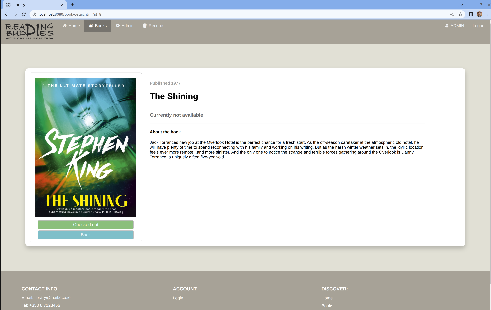

# web-app-dev-group-g

An online library application built as part of the DCU EE417 - Web Application Development module 

Any user can browse and search the library collection. 

As an admin, it is possible to:
* Add: new books which have a title, image, author, ISBN and description
* Modify: update any of the details about the book
* Remove: delete the book from the library
 

As a user it is possible to:
* Borrow: take out a book if no other user has it
* return: return the book when you are finished reading it
* renew books: add an additional two weeks to the due date of the book

Library records keep track of which user has a certain book at a certain time by tracking:
* Borrow date: Date when book was borrowed
* Due date: Date when the book is due to be returned (2 weeks after borrow date)
* Is returned: A Yes or No field
 

Sign up is available for new users who wish to join the library. 

## Screenshots
Home: 

Login: 

Borrow book: 

Account: 

Admin: 

